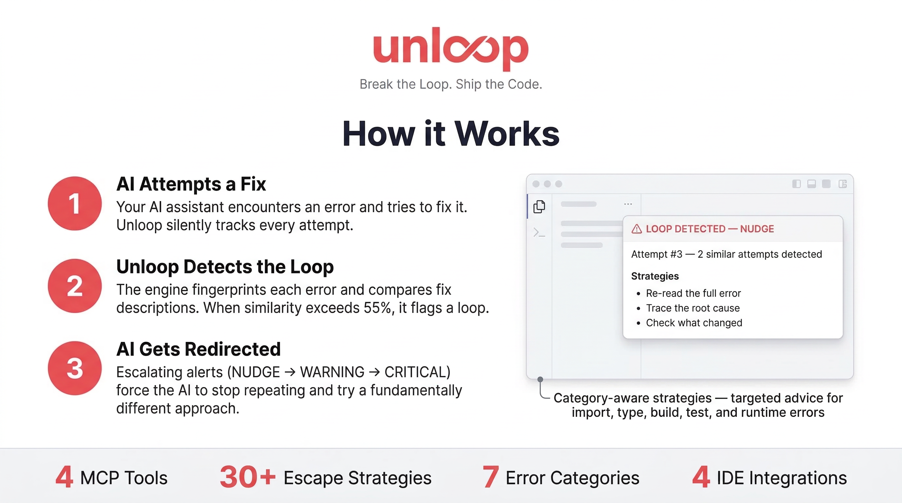

<p align="center">
  
  <br>
  <em>Break the Loop. Ship the Code.</em>
</p>

<p align="center">
  <strong>MCP server that detects when AI coding assistants get stuck in fix loops and forces them to change approach.</strong>
</p>

<p align="center">
  <a href="https://www.npmjs.com/package/unloop-mcp"></a>
  <a href="https://github.com/protonese3/unloop-mcp/blob/master/LICENSE"></a>
  <a href="https://www.npmjs.com/package/unloop-mcp"></a>
</p>

---

## Let your AI set it up for you

Paste this into Claude Code, Cursor, or any MCP-compatible assistant and it will install and configure Unloop for you:

```
Install Unloop MCP to detect fix loops in this project. Here's what to do:

1. Run: claude mcp add unloop -s user -- npx -y unloop-mcp
   (Or for Cursor: create .cursor/mcp.json with {"mcpServers":{"unloop":{"command":"npx","args":["-y","unloop-mcp"]}}})

2. Download the rules file for this IDE from https://raw.githubusercontent.com/protonese3/unloop-mcp/master/rules/claude.md
   and save it to .claude/rules/unloop.md (or the equivalent for Cursor: .cursor/rules/unloop.mdc)

3. Verify the MCP server is connected by running: claude mcp list

After setup, you must follow the Unloop protocol: call log_fix_attempt after every fix attempt,
obey escalation levels (NUDGE/WARNING/CRITICAL), and call resolve_loop when the error is fixed.
```

---

## What is Unloop?

When you use an AI coding assistant (Claude, Cursor, Copilot, Cline...), it sometimes hits an error and tries to fix it — but keeps attempting the same failing approach 5, 10, 20+ times without realizing it's going in circles.

**Unloop stops this.** It's an [MCP server](https://modelcontextprotocol.io/) that runs alongside your AI assistant, tracking every fix attempt. When it detects repetition, it intervenes with escalating alerts and concrete strategies to redirect the AI toward a different approach.

Without Unloop, a stuck AI burns 30+ minutes and 150k+ tokens on the same error. With Unloop, it course-corrects at attempt 3.

---

## How it Works

<p align="center">
  
</p>

### The three-step process

**1. AI Attempts a Fix** — Your AI assistant encounters an error and tries to fix it. Unloop silently tracks every attempt by calling `log_fix_attempt`.

**2. Unloop Detects the Loop** — The engine normalizes each error into a fingerprint (stripping paths, line numbers, timestamps) and compares fix descriptions using [Jaccard similarity](https://en.wikipedia.org/wiki/Jaccard_index). When similarity exceeds 55%, it flags a loop.

**3. AI Gets Redirected** — Escalating alerts force the AI to stop repeating and try a fundamentally different approach. Strategies are targeted by error category (import, type, build, test, runtime).

### Escalation levels

| Level | Trigger | What happens |
|---|---|---|
| **NONE** | 1-2 attempts | Silent tracking. No intervention. |
| **NUDGE** | 3-4 attempts | "You're repeating yourself. Change approach." + strategies |
| **WARNING** | 5-6 attempts | "STOP. Revert your changes. Research first." + strategies |
| **CRITICAL** | 7+ attempts | "STOP. Revert everything. Ask the user for help." |

---

## Quick Start

### 1. Install

```bash
npm install -g unloop-mcp
```

Or use directly without installing:
```bash
npx unloop-mcp
```

### 2. Add the MCP server

**Claude Code** (one command, works in all projects):
```bash
claude mcp add unloop -s user -- npx -y unloop-mcp
```

**Cursor** — add to `.cursor/mcp.json`:
```json
{
  "mcpServers": {
    "unloop": {
      "command": "npx",
      "args": ["-y", "unloop-mcp"]
    }
  }
}
```

**Windsurf** — add to `.windsurf/mcp.json`:
```json
{
  "mcpServers": {
    "unloop": {
      "command": "npx",
      "args": ["-y", "unloop-mcp"]
    }
  }
}
```

### 3. Add the rules file

The rules file tells the AI *when* and *how* to call the Unloop tools. Without it, the AI won't know to use them.

| IDE | Command |
|---|---|
| Claude Code | `cp rules/claude.md your-project/.claude/rules/unloop.md` |
| Cursor | `cp rules/cursor.mdc your-project/.cursor/rules/unloop.mdc` |
| Windsurf | `cp rules/windsurf.md your-project/.windsurfrules` (append) |
| Cline | `cp rules/cline.md your-project/.clinerules` (append) |

### 4. Verify

```bash
claude mcp list
# unloop: ... - ✓ Connected
```

Restart your IDE. The AI now has access to the 4 Unloop tools and the rules instruct it to use them on every fix attempt.

---

## How the detection works

### Error fingerprinting

Each error message is normalized before comparison:
- File paths → stripped (`/Users/alice/src/App.tsx:42` becomes generic)
- Line/column numbers → stripped
- UUIDs, hashes, timestamps, ANSI codes, stack frames → stripped
- Result is SHA-256 hashed into a 16-character fingerprint

This means the same error on different files produces the **same fingerprint**:
```
Cannot find module './Button' in /Users/alice/src/App.tsx:42  →  fingerprint a1b2c3...
Cannot find module './Button' in /Users/bob/src/Main.tsx:7    →  fingerprint a1b2c3...  (same)
```

### Fix similarity

Fix descriptions are tokenized (lowercased, stop-words removed) and compared using Jaccard similarity. If two descriptions share more than 55% of their meaningful words, they're flagged as "the same approach."

This is why the rules file instructs the AI to write **specific** fix descriptions — "Changed import from `./Button` to `@/components/Button` because tsconfig has path aliases" instead of "fixed the import."

### Error categories

Errors are auto-categorized for targeted strategy selection:

| Category | Patterns matched |
|---|---|
| `syntax` | SyntaxError, unexpected token, parsing error |
| `type` | TypeError, type not assignable, TS errors |
| `import` | Cannot find module, module not found |
| `build` | Build failed, compilation error, webpack/vite/tsc |
| `test` | Test failed, assertion errors, jest/vitest/pytest |
| `runtime` | ReferenceError, null pointer, ENOENT, unhandled rejection |

---

## MCP Tools

Unloop exposes 4 tools via the Model Context Protocol:

### `log_fix_attempt`
**Call after every fix attempt.** Records the attempt and returns loop analysis.

```
Parameters:
  error_message    string     The error being fixed
  files_involved   string[]   Files modified in this attempt
  fix_description  string     What was changed and why (be specific)
  session_id       string?    For parallel task isolation (optional)

Returns:
  status           "ok" | "loop_detected"
  loop_level       "NONE" | "NUDGE" | "WARNING" | "CRITICAL"
  attempt_number   number
  similar_attempts number     How many previous fixes used the same approach
  strategies       array?     Escape strategies (when loop detected)
  previous_attempts array?    History of what was tried
```

### `check_loop_status`
**Read-only status check.** Returns current state without recording a new attempt. Use before starting complex fixes.

### `get_escape_strategies`
**Get strategies without logging.** Returns category-specific strategies for planning your next move.

### `resolve_loop`
**Call when the error is fixed.** Resets all tracking counters. If you skip this, the next unrelated error inherits stale state.

---

## Strategies

Unloop includes 30+ built-in escape strategies, matched by error category and escalation level. Examples:

**NUDGE (import error):**
- "Verify the package is installed — check package.json, run the install command"
- "Compare with a working import in the same project — copy the pattern that works"

**WARNING (type error):**
- "Check dependency version alignment — @types packages may be out of sync"
- "Simplify the type chain — break complex generics into intermediate variables"

**CRITICAL (any):**
- "Revert ALL changes since the error first appeared"
- "Ask the user — explain what you tried and why it failed"

---

## Testing

```bash
# Unit + integration + E2E tests (75 tests)
npm test

# Quick smoke test — all tools, escalation, isolation (24 checks)
npx tsx smoke-test.ts

# Interactive demo — simulated loop session with colored output
npx tsx demo.ts
```

---

## Project structure

```
src/
├── index.ts                 # Entry point (stdio transport)
├── server.ts                # MCP tool registration and handlers
├── types.ts                 # Shared TypeScript types
├── detection/
│   ├── fingerprint.ts       # Error normalization, hashing, categorization
│   ├── similarity.ts        # Jaccard similarity on tokenized descriptions
│   └── escalation.ts        # NONE → NUDGE → WARNING → CRITICAL state machine
├── strategies/
│   ├── builtin.ts           # 30+ strategies by category and level
│   └── registry.ts          # Strategy lookup
└── session/
    └── store.ts             # In-memory session state with garbage collection

rules/                       # IDE-specific instruction files
├── cursor.mdc               # Cursor rules
├── claude.md                # Claude Code rules
├── windsurf.md              # Windsurf rules
└── cline.md                 # Cline rules
```

---

## Supported IDEs

| IDE | MCP Support | Rules file |
|---|---|---|
| Claude Code | Native (stdio) | `.claude/rules/unloop.md` |
| Cursor | Native (stdio) | `.cursor/rules/unloop.mdc` |
| Windsurf | Native | `.windsurfrules` |
| Cline (VS Code) | Native | `.clinerules` |

---

## Why MCP?

An MCP server works across every IDE that supports the protocol — one codebase, one server, works everywhere. It's designed to be called by AI, not by humans. And it's the emerging standard: Cursor, Claude Code, Windsurf, and Cline all support it natively.

The alternative (a VS Code extension, a custom CLI wrapper, manual prompt engineering) would be single-IDE, harder to maintain, and less reliable.

---

## Contributing

PRs welcome. The codebase is straightforward:

- **Add a strategy** — edit `src/strategies/builtin.ts`, add to the relevant `LEVEL:CATEGORY` key
- **Improve fingerprinting** — edit `src/detection/fingerprint.ts`, add normalization patterns
- **Add an error category** — edit the `CATEGORY_PATTERNS` array in `fingerprint.ts`
- **Add IDE support** — create a new rules file in `rules/`, add to the CLI init command

Run `npm test` before submitting. All 75 tests must pass.

---

## License

MIT
